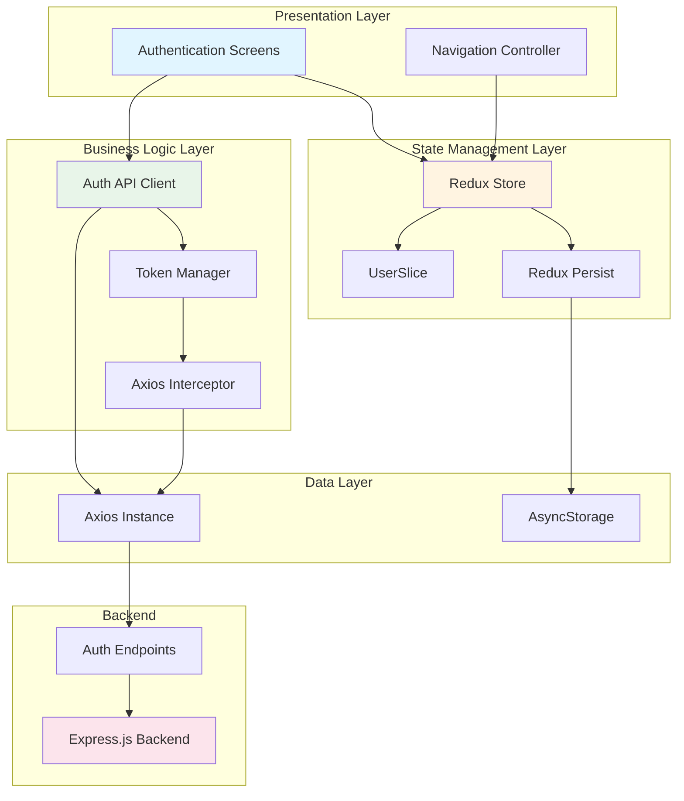
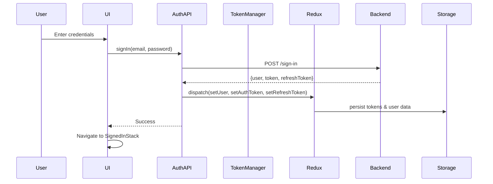
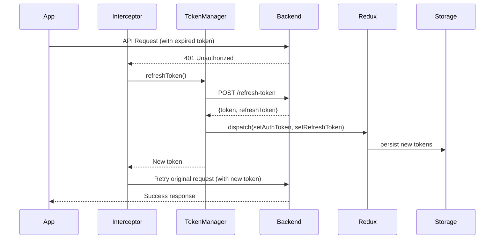

# Authentication Integration Design Document

## Overview

This design document specifies the technical architecture for integrating comprehensive authentication functionality between heyhao-app (React Native) and heyhao-be (Express.js backend). The system implements JWT-based authentication with automatic token refresh, secure session management using Redux Toolkit with Redux Persist, and a complete authentication flow including registration, sign-in, password reset, and logout.

The authentication system is built on a layered architecture that separates concerns between API communication, state management, business logic, and UI presentation. The design emphasizes type safety through TypeScript, security through token-based authentication, and user experience through automatic session management and seamless navigation.

### Key Design Principles

1. **Type Safety**: All API requests, responses, and state management use TypeScript interfaces
2. **Security First**: JWT tokens with automatic refresh, secure storage, and proper token lifecycle management
3. **Separation of Concerns**: Clear boundaries between API client, state management, and UI components
4. **User Experience**: Automatic token refresh, persistent sessions, and seamless navigation
5. **Error Resilience**: Comprehensive error handling with user-friendly messages and graceful degradation

## Architecture

The authentication system follows a layered architecture with clear separation between presentation, business logic, and data layers:



### Authentication Flow



### Token Refresh Flow



## Components and Interfaces

### 1. Auth API Client

The Auth API Client is responsible for all authentication-related HTTP requests. It extends the existing ApiClient class and provides type-safe methods for authentication operations.

**Location**: `heyhao-app/src/services/api/auth/authApi.ts`

**Responsibilities**:
- Execute authentication API requests (sign-up, sign-in, logout, password reset)
- Handle multipart/form-data for photo uploads
- Parse and transform API responses
- Dispatch Redux actions on successful authentication
- Handle and format error responses

**Key Methods**:
```typescript
class AuthApi {
  signUp(data: SignUpRequest): Promise<AuthResponse>
  signIn(data: SignInRequest): Promise<AuthResponse>
  logout(userId: string): Promise<void>
  refreshToken(refreshToken: string): Promise<TokenResponse>
  forgotPassword(email: string): Promise<void>
  updatePassword(tokenId: string, data: UpdatePasswordRequest): Promise<void>
}
```

### 2. Token Manager

The Token Manager handles all token-related operations including storage, retrieval, and refresh logic.

**Location**: `heyhao-app/src/services/auth/tokenManager.ts`

**Responsibilities**:
- Store and retrieve tokens from Redux
- Implement token refresh logic
- Handle token expiration
- Coordinate with Axios interceptors
- Queue requests during token refresh

**Key Methods**:
```typescript
class TokenManager {
  getAccessToken(): string | null
  getRefreshToken(): string | null
  setTokens(accessToken: string, refreshToken: string): void
  clearTokens(): void
  refreshAccessToken(): Promise<string>
  isRefreshing(): boolean
}
```

### 3. Axios Interceptor

The Axios Interceptor automatically handles token attachment and refresh on 401 errors.

**Location**: `heyhao-app/src/services/api/interceptors/authInterceptor.ts`

**Responsibilities**:
- Attach access token to all authenticated requests
- Intercept 401 responses and trigger token refresh
- Queue requests during token refresh
- Retry failed requests after successful token refresh
- Handle token refresh failures

**Implementation Pattern**:
```typescript
// Request interceptor
axios.interceptors.request.use((config) => {
  const token = tokenManager.getAccessToken();
  if (token) {
    config.headers.Authorization = `Bearer ${token}`;
  }
  return config;
});

// Response interceptor
axios.interceptors.response.use(
  (response) => response,
  async (error) => {
    if (error.response?.status === 401 && !error.config._retry) {
      error.config._retry = true;
      const newToken = await tokenManager.refreshAccessToken();
      error.config.headers.Authorization = `Bearer ${newToken}`;
      return axios(error.config);
    }
    return Promise.reject(error);
  }
);
```

### 4. Redux UserSlice

The UserSlice manages authentication state in Redux with persistence.

**Location**: `heyhao-app/src/store/UserSlice.ts` (existing, to be enhanced)

**State Structure**:
```typescript
interface UserState {
  user: User | null;
  authToken: string | null;
  refreshToken: string | null;
  isAuthenticated: boolean;
  isLoading: boolean;
}
```

**Actions**:
- `setUser(user: User)`: Store user data
- `setAuthToken(token: string)`: Store access token
- `setRefreshToken(token: string)`: Store refresh token
- `clearAuth()`: Clear all authentication data
- `setLoading(isLoading: boolean)`: Set loading state

**Selectors**:
- `selectUser`: Get current user
- `selectAuthToken`: Get access token
- `selectRefreshToken`: Get refresh token
- `selectIsAuthenticated`: Check authentication status

### 5. Navigation Controller

The Navigation Controller manages routing based on authentication state.

**Location**: `heyhao-app/src/navigation/Navigation.tsx` (existing, to be enhanced)

**Responsibilities**:
- Determine initial route based on stored tokens
- Navigate between authenticated and unauthenticated stacks
- Reset navigation stack on authentication state changes
- Prevent unauthorized access to protected screens

**Navigation Logic**:
```typescript
const Navigation = () => {
  const isAuthenticated = useSelector(selectIsAuthenticated);
  const [isReady, setIsReady] = useState(false);
  
  useEffect(() => {
    // Check for stored tokens on app start
    checkAuthStatus().then(() => setIsReady(true));
  }, []);
  
  if (!isReady) return <SplashScreen />;
  
  return (
    <NavigationContainer>
      {isAuthenticated ? <SignedInStack /> : <LandingScreen />}
    </NavigationContainer>
  );
};
```

### 6. Form Validators

Form validators ensure data integrity before API submission.

**Location**: `heyhao-app/src/utils/validators/authValidators.ts`

**Validation Rules**:
- Email: Valid email format
- Password: Minimum 6 characters
- Name: Minimum 1 character
- Confirm Password: Matches password field

**Implementation**:
```typescript
export const validateEmail = (email: string): string | null => {
  const emailRegex = /^[^\s@]+@[^\s@]+\.[^\s@]+$/;
  return emailRegex.test(email) ? null : 'Invalid email format';
};

export const validatePassword = (password: string): string | null => {
  return password.length >= 6 ? null : 'Password must be at least 6 characters';
};
```

### 7. Photo Uploader

The Photo Uploader handles image selection and multipart upload.

**Location**: `heyhao-app/src/services/media/photoUploader.ts`

**Responsibilities**:
- Launch image picker (camera or gallery)
- Validate image size and format
- Prepare FormData for multipart upload
- Handle upload errors

**Key Methods**:
```typescript
class PhotoUploader {
  selectPhoto(): Promise<ImagePickerResponse>
  prepareFormData(photo: Asset, userData: SignUpData): FormData
  validatePhoto(photo: Asset): ValidationResult
}
```

## Data Models

### TypeScript Interfaces

#### Request Types

```typescript
// Sign Up Request
export interface SignUpRequest {
  name: string;
  email: string;
  password: string;
  photo: Asset; // from react-native-image-picker
}

// Sign In Request
export interface SignInRequest {
  email: string;
  password: string;
}

// Refresh Token Request
export interface RefreshTokenRequest {
  refreshToken: string;
}

// Logout Request
export interface LogoutRequest {
  userId: string;
}

// Forgot Password Request
export interface ForgotPasswordRequest {
  email: string;
}

// Update Password Request
export interface UpdatePasswordRequest {
  password: string;
  confirmPassword: string;
}
```

#### Response Types

```typescript
// Base API Response (matches backend)
export interface ApiResponse<T = any> {
  success: boolean;
  message: string;
  data?: T;
  errors?: Array<{
    field?: string;
    message: string;
  }>;
}

// User Data
export interface User {
  id: string;
  name: string;
  email: string;
  photo: string;
}

// Authentication Response
export interface AuthResponse {
  user: User;
  token: string;
  refreshToken: string;
}

// Token Response
export interface TokenResponse {
  token: string;
  refreshToken: string;
}
```

#### State Types

```typescript
// User State (Redux)
export interface UserState {
  user: User | null;
  authToken: string | null;
  refreshToken: string | null;
  isAuthenticated: boolean;
  isLoading: boolean;
  error: string | null;
}

// Form State
export interface SignUpFormState {
  name: string;
  email: string;
  password: string;
  photo: Asset | null;
  errors: {
    name?: string;
    email?: string;
    password?: string;
    photo?: string;
  };
}

export interface SignInFormState {
  email: string;
  password: string;
  errors: {
    email?: string;
    password?: string;
  };
}
```

### Backend API Contract

The frontend must align with the existing backend API structure:

#### Endpoints

```
POST   /api/auth/sign-up
POST   /api/auth/sign-in
POST   /api/auth/refresh-token
POST   /api/auth/logout
POST   /api/auth/forgot-password
PUT    /api/auth/forgot-password/:tokenId
```

#### Request/Response Examples

**Sign Up**:
```typescript
// Request (multipart/form-data)
{
  name: "John Doe",
  email: "john@example.com",
  password: "password123",
  photo: <File>
}

// Response
{
  success: true,
  message: "User created successfully",
  data: {
    id: "uuid",
    name: "John Doe",
    email: "john@example.com",
    photo: "filename.jpg",
    token: "eyJhbGc...",
    refreshToken: "eyJhbGc..."
  }
}
```

**Sign In**:
```typescript
// Request
{
  email: "john@example.com",
  password: "password123"
}

// Response
{
  success: true,
  message: "User signed in successfully",
  data: {
    id: "uuid",
    name: "John Doe",
    email: "john@example.com",
    photo: "filename.jpg",
    token: "eyJhbGc...",
    refreshToken: "eyJhbGc..."
  }
}
```

**Refresh Token**:
```typescript
// Request
{
  refreshToken: "eyJhbGc..."
}

// Response
{
  success: true,
  message: "Token refreshed successfully",
  data: {
    token: "eyJhbGc...",
    refreshToken: "eyJhbGc..."
  }
}
```

**Error Response**:
```typescript
{
  success: false,
  message: "Validation failed",
  errors: [
    {
      field: "email",
      message: "Invalid email address"
    }
  ]
}
```


## API Integration Details

### Base Configuration

The API client will be configured with the backend base URL from environment variables:

```typescript
// heyhao-app/.env
API_BASE_URL=http://localhost:3000/api
```

### Axios Instance Configuration

```typescript
const apiClient = axios.create({
  baseURL: process.env.API_BASE_URL,
  timeout: 10000,
  headers: {
    'Content-Type': 'application/json',
  },
});
```

### Authentication Header Format

All authenticated requests include the JWT token in the Authorization header:

```
Authorization: Bearer <access_token>
```

### Multipart Form Data for Sign Up

Sign-up requests use multipart/form-data to support photo upload:

```typescript
const formData = new FormData();
formData.append('name', data.name);
formData.append('email', data.email);
formData.append('password', data.password);
formData.append('photo', {
  uri: photo.uri,
  type: photo.type,
  name: photo.fileName,
});

axios.post('/auth/sign-up', formData, {
  headers: {
    'Content-Type': 'multipart/form-data',
  },
});
```

### Rate Limiting Handling

The backend implements rate limiting on auth endpoints. The client should handle 429 responses:

```typescript
if (error.response?.status === 429) {
  throw new Error('Too many requests. Please try again later.');
}
```

## Token Refresh Mechanism

### Automatic Token Refresh Strategy

The token refresh mechanism uses Axios interceptors to automatically refresh expired tokens without user intervention.

#### Request Queue During Refresh

To prevent multiple simultaneous refresh requests, the system implements a request queue:

```typescript
let isRefreshing = false;
let failedQueue: Array<{
  resolve: (token: string) => void;
  reject: (error: any) => void;
}> = [];

const processQueue = (error: any, token: string | null = null) => {
  failedQueue.forEach(promise => {
    if (error) {
      promise.reject(error);
    } else {
      promise.resolve(token!);
    }
  });
  failedQueue = [];
};
```

#### Interceptor Implementation

```typescript
axios.interceptors.response.use(
  (response) => response,
  async (error) => {
    const originalRequest = error.config;

    // Check if error is 401 and request hasn't been retried
    if (error.response?.status === 401 && !originalRequest._retry) {
      if (isRefreshing) {
        // Queue the request
        return new Promise((resolve, reject) => {
          failedQueue.push({ resolve, reject });
        })
          .then(token => {
            originalRequest.headers.Authorization = `Bearer ${token}`;
            return axios(originalRequest);
          })
          .catch(err => Promise.reject(err));
      }

      originalRequest._retry = true;
      isRefreshing = true;

      try {
        const refreshToken = await tokenManager.getRefreshToken();
        if (!refreshToken) {
          throw new Error('No refresh token available');
        }

        const response = await axios.post('/auth/refresh-token', {
          refreshToken,
        });

        const { token, refreshToken: newRefreshToken } = response.data.data;

        // Update tokens in Redux
        store.dispatch(setAuthToken(token));
        store.dispatch(setRefreshToken(newRefreshToken));

        // Update default header
        axios.defaults.headers.common.Authorization = `Bearer ${token}`;
        originalRequest.headers.Authorization = `Bearer ${token}`;

        // Process queued requests
        processQueue(null, token);

        return axios(originalRequest);
      } catch (refreshError) {
        processQueue(refreshError, null);
        
        // Clear auth state and navigate to login
        store.dispatch(clearAuth());
        // Navigation will be handled by Navigation component watching auth state
        
        return Promise.reject(refreshError);
      } finally {
        isRefreshing = false;
      }
    }

    return Promise.reject(error);
  }
);
```

### Token Lifecycle

1. **Initial Authentication**: User signs in, receives access token and refresh token
2. **Token Storage**: Both tokens stored in Redux and persisted to AsyncStorage
3. **Request Authentication**: Access token attached to all API requests
4. **Token Expiration**: Backend returns 401 when access token expires
5. **Automatic Refresh**: Interceptor catches 401, uses refresh token to get new tokens
6. **Token Update**: New tokens stored and original request retried
7. **Refresh Failure**: If refresh fails, user is logged out and redirected to login

### Security Considerations for Token Refresh

- Refresh tokens are stored securely in AsyncStorage (encrypted on iOS, Keystore on Android)
- Refresh token is revoked on logout
- Failed refresh attempts clear all auth state
- Only one refresh request is made at a time (queuing mechanism)
- Refresh tokens have longer expiration than access tokens (configured on backend)

## Redux State Management Design

### Store Configuration

```typescript
// heyhao-app/src/store/store.ts
import AsyncStorage from '@react-native-async-storage/async-storage';
import { configureStore } from '@reduxjs/toolkit';
import { combineReducers } from 'redux';
import { persistReducer, persistStore } from 'redux-persist';
import UserSlice from './UserSlice';

const reducers = combineReducers({
  UserSlice,
});

const persistConfig = {
  key: 'root',
  storage: AsyncStorage,
  whitelist: ['UserSlice'], // Persist UserSlice
};

const persistedReducer = persistReducer(persistConfig, reducers);

const store = configureStore({
  reducer: persistedReducer,
  middleware: (getDefaultMiddleware) =>
    getDefaultMiddleware({
      serializableCheck: {
        ignoredActions: ['persist/PERSIST', 'persist/REHYDRATE'],
      },
    }),
});

export type RootState = ReturnType<typeof store.getState>;
export type AppDispatch = typeof store.dispatch;

export const persistor = persistStore(store);
export default store;
```

### Enhanced UserSlice

```typescript
// heyhao-app/src/store/UserSlice.ts
import { createSlice, PayloadAction } from '@reduxjs/toolkit';

export interface User {
  id: string;
  name: string;
  email: string;
  photo: string;
}

export interface UserState {
  user: User | null;
  authToken: string | null;
  refreshToken: string | null;
  isAuthenticated: boolean;
  isLoading: boolean;
  error: string | null;
}

const initialState: UserState = {
  user: null,
  authToken: null,
  refreshToken: null,
  isAuthenticated: false,
  isLoading: false,
  error: null,
};

export const UserSlice = createSlice({
  name: 'UserSlice',
  initialState,
  reducers: {
    setUser: (state, action: PayloadAction<User>) => {
      state.user = action.payload;
      state.isAuthenticated = true;
      state.error = null;
    },
    setAuthToken: (state, action: PayloadAction<string>) => {
      state.authToken = action.payload;
    },
    setRefreshToken: (state, action: PayloadAction<string>) => {
      state.refreshToken = action.payload;
    },
    setLoading: (state, action: PayloadAction<boolean>) => {
      state.isLoading = action.payload;
    },
    setError: (state, action: PayloadAction<string | null>) => {
      state.error = action.payload;
      state.isLoading = false;
    },
    clearAuth: (state) => {
      state.user = null;
      state.authToken = null;
      state.refreshToken = null;
      state.isAuthenticated = false;
      state.error = null;
    },
  },
});

export const {
  setUser,
  setAuthToken,
  setRefreshToken,
  setLoading,
  setError,
  clearAuth,
} = UserSlice.actions;

// Selectors
export const selectUser = (state: { UserSlice: UserState }) => state.UserSlice.user;
export const selectAuthToken = (state: { UserSlice: UserState }) => state.UserSlice.authToken;
export const selectRefreshToken = (state: { UserSlice: UserState }) => state.UserSlice.refreshToken;
export const selectIsAuthenticated = (state: { UserSlice: UserState }) => state.UserSlice.isAuthenticated;
export const selectIsLoading = (state: { UserSlice: UserState }) => state.UserSlice.isLoading;
export const selectError = (state: { UserSlice: UserState }) => state.UserSlice.error;

export default UserSlice.reducer;
```

### State Persistence Strategy

**What to Persist**:
- User data (id, name, email, photo)
- Access token
- Refresh token

**What NOT to Persist**:
- Loading states
- Error messages

**Rehydration Flow**:
1. App starts
2. Redux Persist loads state from AsyncStorage
3. Navigation component checks `isAuthenticated` flag
4. If authenticated, navigate to SignedInStack
5. If not authenticated, show LandingScreen

### Actions and Reducers

**Authentication Actions**:
- `setUser(user)`: Store user data after successful authentication
- `setAuthToken(token)`: Store access token
- `setRefreshToken(token)`: Store refresh token
- `clearAuth()`: Clear all authentication data on logout or token refresh failure

**UI State Actions**:
- `setLoading(boolean)`: Control loading indicators
- `setError(message)`: Store error messages for display

**Action Dispatch Pattern**:
```typescript
// In Auth API Client
const signIn = async (data: SignInRequest) => {
  dispatch(setLoading(true));
  try {
    const response = await axios.post('/auth/sign-in', data);
    const { user, token, refreshToken } = response.data.data;
    
    dispatch(setUser(user));
    dispatch(setAuthToken(token));
    dispatch(setRefreshToken(refreshToken));
    dispatch(setLoading(false));
    
    return response.data;
  } catch (error) {
    dispatch(setError(parseErrorMessage(error)));
    dispatch(setLoading(false));
    throw error;
  }
};
```


## Correctness Properties

*A property is a characteristic or behavior that should hold true across all valid executions of a system-essentially, a formal statement about what the system should do. Properties serve as the bridge between human-readable specifications and machine-verifiable correctness guarantees.*

### Property Reflection

After analyzing all acceptance criteria, several properties were identified as redundant or overlapping:

**Consolidated Properties**:
- Validation rules (email, password, name) appear across multiple requirements but represent the same underlying validation logic
- Loading state management appears in multiple screens but follows the same pattern
- Error mapping from backend to UI appears in multiple flows but uses the same mechanism
- Token storage after successful authentication appears in both sign-up and sign-in
- Navigation after successful authentication appears in both sign-up and sign-in

**Eliminated Redundancies**:
- Combined duplicate validation properties into single comprehensive validation properties
- Combined duplicate loading state properties into single UI state management property
- Combined duplicate error mapping properties into single error handling property
- Combined duplicate token storage properties into single session management property
- Combined duplicate navigation properties into single navigation flow property

### Property 1: Form Validation - Name Length

*For any* name input string, the form validator should accept strings with length >= 1 and reject empty strings with an appropriate error message.

**Validates: Requirements 1.3**

### Property 2: Form Validation - Email Format

*For any* email input string, the form validator should accept valid email formats (containing @ and domain) and reject invalid formats with an appropriate error message.

**Validates: Requirements 1.4, 2.3, 5.3**

### Property 3: Form Validation - Password Length (Registration)

*For any* password input string during registration or password reset, the form validator should accept strings with length >= 6 and reject shorter strings with an appropriate error message.

**Validates: Requirements 1.5, 6.3**

### Property 4: Form Validation - Password Length (Sign In)

*For any* password input string during sign-in, the form validator should accept non-empty strings and reject empty strings with an appropriate error message.

**Validates: Requirements 2.4**

### Property 5: Form Validation - Password Confirmation Match

*For any* password and confirmPassword pair, the form validator should accept pairs where both values are identical and reject mismatched pairs with an appropriate error message.

**Validates: Requirements 6.4**

### Property 6: Multipart Form Data Encoding

*For any* valid sign-up data (name, email, password, photo), the Auth API Client should encode the request as multipart/form-data with all fields properly formatted.

**Validates: Requirements 1.2**

### Property 7: Authentication Success - User Data Storage

*For any* successful authentication response (sign-up or sign-in), the User Store should contain the user data (id, name, email, photo) from the response.

**Validates: Requirements 1.7, 2.5**

### Property 8: Authentication Success - Token Storage

*For any* successful authentication response (sign-up or sign-in), the Session Manager should store both the access token and refresh token from the response.

**Validates: Requirements 1.8, 2.6**

### Property 9: Backend Error Mapping

*For any* backend validation error response containing field-specific errors, the error handler should map each error to its corresponding form field for display.

**Validates: Requirements 1.11, 2.9, 5.6, 6.8, 9.8**

### Property 10: Loading State Management

*For any* authentication request (sign-up, sign-in, logout, password reset), the loading state should be true while the request is pending and false when the request completes (success or failure).

**Validates: Requirements 1.12, 2.10, 5.7, 6.9, 11.1, 11.3**

### Property 11: Button State During Requests

*For any* authentication form, submission buttons should be disabled while a request is pending and re-enabled when the request completes.

**Validates: Requirements 11.2, 11.4**

### Property 12: API Request Format - Sign In

*For any* valid sign-in credentials (email, password), the Auth API Client should send a POST request to /sign-in with the credentials in the request body.

**Validates: Requirements 2.2**

### Property 13: Token Refresh on 401

*For any* API request that receives a 401 Unauthorized response (excluding the refresh token endpoint itself), the Token Interceptor should automatically attempt to refresh the access token before retrying the request.

**Validates: Requirements 3.2**

### Property 14: Token Refresh Request Format

*For any* token refresh attempt, the Token Interceptor should send a POST request to /refresh-token with the current refresh token in the request body.

**Validates: Requirements 3.3**

### Property 15: Token Update After Refresh

*For any* successful token refresh response, the Session Manager should update both the access token and refresh token in Redux state and AsyncStorage.

**Validates: Requirements 3.4**

### Property 16: Request Retry After Token Refresh

*For any* API request that triggered token refresh, after successful token refresh, the original request should be retried with the new access token.

**Validates: Requirements 3.5**

### Property 17: Token Refresh Serialization

*For any* set of concurrent API requests that receive 401 responses, only one token refresh request should be initiated, and subsequent requests should be queued until the refresh completes.

**Validates: Requirements 3.8, 11.6**

### Property 18: Authorization Header Attachment

*For any* authenticated API request, the Token Interceptor should attach the current access token to the request via the Authorization header in the format "Bearer <token>".

**Validates: Requirements 3.9**

### Property 19: Logout Request Format

*For any* logout operation, the Auth API Client should send a POST request to /logout with the userId in the request body.

**Validates: Requirements 4.2**

### Property 20: Logout Cleanup

*For any* logout operation (successful or failed), the Session Manager should clear all tokens from Redux state and AsyncStorage, and the User Store should clear all user data.

**Validates: Requirements 4.3, 4.4, 4.6**

### Property 21: Password Reset Request Format

*For any* valid email address, the Auth API Client should send a POST request to /forgot-password with the email in the request body.

**Validates: Requirements 5.2**

### Property 22: Password Update Request Format

*For any* valid password update data (tokenId, password, confirmPassword), the Auth API Client should send a PUT request to /forgot-password/:tokenId with the password data in the request body.

**Validates: Requirements 6.2**

### Property 23: Token Persistence

*For any* authentication tokens (access token and refresh token) stored in Redux state, the tokens should be persisted to AsyncStorage via Redux Persist.

**Validates: Requirements 8.3**

### Property 24: User Data Persistence

*For any* user data stored in Redux state, the data should be persisted to AsyncStorage via Redux Persist.

**Validates: Requirements 8.4**

### Property 25: AsyncStorage Error Resilience

*For any* AsyncStorage operation error (read or write), the application should handle the error gracefully without crashing and continue functioning with in-memory state.

**Validates: Requirements 8.10**

### Property 26: Error Logging

*For any* API error response, the Auth API Client should log detailed error information (status code, error message, request details) for debugging purposes.

**Validates: Requirements 9.9**

### Property 27: Error Message Sanitization

*For any* error message displayed to users, the message should not contain sensitive technical details such as stack traces, database queries, or internal system information.

**Validates: Requirements 9.10**

### Property 28: Navigation Guards - Authenticated Access

*For any* navigation attempt to authenticated screens (SignedInStack), the Navigation Controller should prevent access when the user is not authenticated (no valid tokens).

**Validates: Requirements 10.8**

### Property 29: Navigation Guards - Unauthenticated Access

*For any* navigation attempt to authentication screens (SignedOutStack) when the user is authenticated, the Navigation Controller should prevent backward navigation to those screens.

**Validates: Requirements 10.7**

### Property 30: Navigation Stack Reset

*For any* transition between authenticated and unauthenticated states (login, logout, token refresh failure), the Navigation Controller should reset the navigation stack to prevent back navigation to the previous state.

**Validates: Requirements 10.9**

### Property 31: Navigation History Isolation

*For any* navigation within the authenticated stack or unauthenticated stack, the navigation history should be maintained independently and cleared when transitioning to the other stack.

**Validates: Requirements 10.10**

### Property 32: Request Queue Processing

*For any* queued API requests during token refresh, when the token refresh completes successfully, all queued requests should be automatically processed with the new access token.

**Validates: Requirements 11.8**

### Property 33: Form Submission Prevention

*For any* authentication form with a pending request, subsequent form submissions should be prevented until the current request completes.

**Validates: Requirements 11.9**

### Property 34: Validation Error Feedback

*For any* form validation error, the error message should be displayed immediately (synchronously) without requiring a server round-trip.

**Validates: Requirements 11.10**


## Error Handling

### Error Classification

The authentication system handles errors at multiple layers with specific strategies for each error type:

#### 1. Network Errors

**Causes**: No internet connection, DNS resolution failure, request timeout

**Handling Strategy**:
```typescript
if (error.code === 'ECONNABORTED' || error.message === 'Network Error') {
  return {
    type: 'NETWORK_ERROR',
    message: 'Network error. Please check your connection.',
    userMessage: 'Unable to connect. Check your internet connection and try again.',
  };
}
```

**User Experience**:
- Display user-friendly message
- Provide retry button
- Cache request for retry when connection restored (optional enhancement)

#### 2. Validation Errors (400 Bad Request)

**Causes**: Invalid input data, missing required fields, format violations

**Handling Strategy**:
```typescript
if (error.response?.status === 400) {
  const errors = error.response.data.errors || [];
  return {
    type: 'VALIDATION_ERROR',
    fieldErrors: errors.reduce((acc, err) => ({
      ...acc,
      [err.field]: err.message,
    }), {}),
  };
}
```

**User Experience**:
- Display field-specific error messages below each input
- Highlight invalid fields with red border
- Keep form data intact for correction

#### 3. Authentication Errors (401 Unauthorized)

**Causes**: Invalid credentials, expired token, revoked token

**Handling Strategy**:
```typescript
if (error.response?.status === 401) {
  // For login/signup endpoints
  if (isAuthEndpoint(error.config.url)) {
    return {
      type: 'AUTH_ERROR',
      message: 'Invalid email or password.',
    };
  }
  
  // For protected endpoints - trigger token refresh
  return triggerTokenRefresh(error);
}
```

**User Experience**:
- For login: Display "Invalid email or password"
- For token expiration: Automatic refresh (transparent to user)
- For refresh failure: Redirect to login with "Session expired" message

#### 4. Resource Not Found (404 Not Found)

**Causes**: Invalid reset token, deleted user, non-existent resource

**Handling Strategy**:
```typescript
if (error.response?.status === 404) {
  const context = getErrorContext(error.config.url);
  return {
    type: 'NOT_FOUND_ERROR',
    message: context === 'password-reset' 
      ? 'Invalid or expired reset link.'
      : 'Email not found.',
  };
}
```

**User Experience**:
- Display context-specific error message
- Provide navigation to relevant screen (e.g., request new reset link)

#### 5. Conflict Errors (409 Conflict)

**Causes**: Email already registered, duplicate resource

**Handling Strategy**:
```typescript
if (error.response?.status === 409) {
  return {
    type: 'CONFLICT_ERROR',
    message: 'Email already exists. Please sign in or use a different email.',
  };
}
```

**User Experience**:
- Display clear conflict message
- Suggest alternative actions (sign in, use different email)

#### 6. Rate Limiting (429 Too Many Requests)

**Causes**: Exceeded rate limit on auth endpoints

**Handling Strategy**:
```typescript
if (error.response?.status === 429) {
  const retryAfter = error.response.headers['retry-after'] || 60;
  return {
    type: 'RATE_LIMIT_ERROR',
    message: `Too many attempts. Please try again in ${retryAfter} seconds.`,
    retryAfter,
  };
}
```

**User Experience**:
- Display countdown timer
- Disable submit button until retry time expires
- Show clear message about rate limiting

#### 7. Server Errors (500 Internal Server Error)

**Causes**: Backend crashes, database errors, unhandled exceptions

**Handling Strategy**:
```typescript
if (error.response?.status >= 500) {
  // Log detailed error for debugging
  logger.error('Server error', {
    url: error.config.url,
    status: error.response.status,
    data: error.response.data,
  });
  
  return {
    type: 'SERVER_ERROR',
    message: 'An unexpected error occurred. Please try again later.',
  };
}
```

**User Experience**:
- Display generic error message (don't expose internal details)
- Provide retry button
- Log error for debugging

### Error Recovery Strategies

#### Automatic Retry

For transient errors (network issues, timeouts), implement exponential backoff:

```typescript
const retryRequest = async (fn: () => Promise<any>, maxRetries = 3) => {
  for (let i = 0; i < maxRetries; i++) {
    try {
      return await fn();
    } catch (error) {
      if (i === maxRetries - 1 || !isRetryableError(error)) {
        throw error;
      }
      await delay(Math.pow(2, i) * 1000); // Exponential backoff
    }
  }
};
```

#### Graceful Degradation

When token refresh fails:
1. Clear authentication state
2. Preserve user's current screen context
3. Show session expired message
4. Navigate to login
5. After re-authentication, attempt to restore previous context

#### Error Boundaries

Wrap authentication screens in error boundaries to catch rendering errors:

```typescript
class AuthErrorBoundary extends React.Component {
  componentDidCatch(error, errorInfo) {
    logger.error('Auth screen error', { error, errorInfo });
    // Show fallback UI
  }
}
```

### Error Logging

All errors are logged with appropriate detail levels:

**Development**:
- Full error stack traces
- Request/response details
- Redux state snapshots

**Production**:
- Error type and message
- User ID (if authenticated)
- Request URL and method
- Timestamp
- No sensitive data (passwords, tokens)

## Testing Strategy

### Dual Testing Approach

The authentication integration will be tested using both unit tests and property-based tests to ensure comprehensive coverage:

**Unit Tests**: Verify specific examples, edge cases, and error conditions
**Property Tests**: Verify universal properties across all inputs

Both testing approaches are complementary and necessary for comprehensive coverage. Unit tests catch concrete bugs in specific scenarios, while property tests verify general correctness across a wide range of inputs.

### Property-Based Testing Configuration

**Library**: fast-check (for TypeScript/JavaScript)

**Installation**:
```bash
npm install --save-dev fast-check
```

**Configuration**:
- Minimum 100 iterations per property test (due to randomization)
- Each property test must reference its design document property
- Tag format: `// Feature: authentication-integration, Property {number}: {property_text}`

**Example Property Test**:
```typescript
import fc from 'fast-check';

// Feature: authentication-integration, Property 2: Form Validation - Email Format
describe('Email Validation Property', () => {
  it('should accept valid email formats and reject invalid formats', () => {
    fc.assert(
      fc.property(
        fc.emailAddress(),
        (validEmail) => {
          const result = validateEmail(validEmail);
          expect(result).toBeNull(); // No error for valid email
        }
      ),
      { numRuns: 100 }
    );

    fc.assert(
      fc.property(
        fc.string().filter(s => !s.includes('@')),
        (invalidEmail) => {
          const result = validateEmail(invalidEmail);
          expect(result).toBe('Invalid email format');
        }
      ),
      { numRuns: 100 }
    );
  });
});
```

### Unit Testing Strategy

#### Test Organization

```
heyhao-app/
├── src/
│   ├── services/
│   │   ├── api/
│   │   │   ├── auth/
│   │   │   │   ├── authApi.ts
│   │   │   │   └── __tests__/
│   │   │   │       ├── authApi.test.ts
│   │   │   │       └── authApi.integration.test.ts
│   │   ├── auth/
│   │   │   ├── tokenManager.ts
│   │   │   └── __tests__/
│   │   │       └── tokenManager.test.ts
│   ├── store/
│   │   ├── UserSlice.ts
│   │   └── __tests__/
│   │       └── UserSlice.test.ts
│   ├── utils/
│   │   ├── validators/
│   │   │   ├── authValidators.ts
│   │   │   └── __tests__/
│   │   │       └── authValidators.test.ts
```

#### Test Coverage Requirements

**Minimum Coverage Targets**:
- Statements: 80%
- Branches: 75%
- Functions: 80%
- Lines: 80%

**Critical Paths (100% Coverage)**:
- Token refresh logic
- Error handling and mapping
- Redux state mutations
- Navigation flow logic

#### Unit Test Examples

**Validation Tests**:
```typescript
describe('authValidators', () => {
  describe('validateEmail', () => {
    it('should return null for valid email', () => {
      expect(validateEmail('test@example.com')).toBeNull();
    });

    it('should return error for invalid email', () => {
      expect(validateEmail('invalid')).toBe('Invalid email format');
    });

    it('should return error for empty email', () => {
      expect(validateEmail('')).toBe('Invalid email format');
    });
  });

  describe('validatePassword', () => {
    it('should return null for password with 6+ characters', () => {
      expect(validatePassword('password123')).toBeNull();
    });

    it('should return error for password with <6 characters', () => {
      expect(validatePassword('pass')).toBe('Password must be at least 6 characters');
    });
  });
});
```

**Redux State Tests**:
```typescript
describe('UserSlice', () => {
  it('should set user data on setUser action', () => {
    const user = { id: '1', name: 'John', email: 'john@example.com', photo: 'photo.jpg' };
    const state = UserSlice.reducer(initialState, setUser(user));
    
    expect(state.user).toEqual(user);
    expect(state.isAuthenticated).toBe(true);
  });

  it('should clear all data on clearAuth action', () => {
    const authenticatedState = {
      user: { id: '1', name: 'John', email: 'john@example.com', photo: 'photo.jpg' },
      authToken: 'token',
      refreshToken: 'refresh',
      isAuthenticated: true,
    };
    
    const state = UserSlice.reducer(authenticatedState, clearAuth());
    
    expect(state.user).toBeNull();
    expect(state.authToken).toBeNull();
    expect(state.refreshToken).toBeNull();
    expect(state.isAuthenticated).toBe(false);
  });
});
```

**API Client Tests** (with mocked axios):
```typescript
describe('AuthApi', () => {
  let mockAxios: jest.Mocked<AxiosInstance>;
  let authApi: AuthApi;

  beforeEach(() => {
    mockAxios = {
      post: jest.fn(),
      put: jest.fn(),
    } as any;
    authApi = new AuthApi(mockAxios);
  });

  describe('signIn', () => {
    it('should send POST request to /sign-in with credentials', async () => {
      const credentials = { email: 'test@example.com', password: 'password123' };
      const mockResponse = {
        data: {
          success: true,
          data: {
            user: { id: '1', name: 'John', email: 'test@example.com', photo: 'photo.jpg' },
            token: 'access-token',
            refreshToken: 'refresh-token',
          },
        },
      };

      mockAxios.post.mockResolvedValue(mockResponse);

      const result = await authApi.signIn(credentials);

      expect(mockAxios.post).toHaveBeenCalledWith('/auth/sign-in', credentials);
      expect(result).toEqual(mockResponse.data.data);
    });

    it('should handle 401 error for invalid credentials', async () => {
      const credentials = { email: 'test@example.com', password: 'wrong' };
      mockAxios.post.mockRejectedValue({
        response: { status: 401, data: { message: 'Invalid email or password' } },
      });

      await expect(authApi.signIn(credentials)).rejects.toThrow();
    });
  });
});
```

**Token Interceptor Tests**:
```typescript
describe('Token Interceptor', () => {
  it('should attach Authorization header to requests', async () => {
    const token = 'test-token';
    tokenManager.getAccessToken = jest.fn().mockReturnValue(token);

    const config = { headers: {} };
    const result = await requestInterceptor(config);

    expect(result.headers.Authorization).toBe(`Bearer ${token}`);
  });

  it('should refresh token on 401 response', async () => {
    const error = {
      response: { status: 401 },
      config: { url: '/api/protected', headers: {} },
    };

    tokenManager.refreshAccessToken = jest.fn().mockResolvedValue('new-token');

    const result = await responseInterceptor(error);

    expect(tokenManager.refreshAccessToken).toHaveBeenCalled();
    expect(result.config.headers.Authorization).toBe('Bearer new-token');
  });
});
```

### Integration Testing

**Navigation Flow Tests**:
```typescript
describe('Authentication Navigation Flow', () => {
  it('should navigate to SignedInStack after successful sign-in', async () => {
    const { getByTestId } = render(<Navigation />);
    
    // Mock successful sign-in
    mockAuthApi.signIn.mockResolvedValue({
      user: mockUser,
      token: 'token',
      refreshToken: 'refresh',
    });

    // Trigger sign-in
    await act(async () => {
      await signIn({ email: 'test@example.com', password: 'password' });
    });

    // Verify navigation to authenticated stack
    expect(getByTestId('signed-in-stack')).toBeTruthy();
  });

  it('should navigate to LandingScreen after logout', async () => {
    const { getByTestId } = render(<Navigation />);
    
    // Start authenticated
    store.dispatch(setUser(mockUser));
    store.dispatch(setAuthToken('token'));

    // Trigger logout
    await act(async () => {
      await logout(mockUser.id);
    });

    // Verify navigation to landing
    expect(getByTestId('landing-screen')).toBeTruthy();
  });
});
```

### End-to-End Testing

**Critical User Flows**:
1. Complete registration flow (photo upload → sign up → navigate to home)
2. Sign in flow (credentials → authenticate → navigate to home)
3. Token refresh flow (make request → token expires → auto refresh → request succeeds)
4. Password reset flow (request reset → receive email → update password → sign in)
5. Logout flow (logout → clear data → navigate to landing)

**E2E Test Example** (using Detox):
```typescript
describe('Authentication E2E', () => {
  it('should complete sign-up flow', async () => {
    await element(by.id('sign-up-button')).tap();
    
    await element(by.id('name-input')).typeText('John Doe');
    await element(by.id('email-input')).typeText('john@example.com');
    await element(by.id('password-input')).typeText('password123');
    await element(by.id('photo-picker')).tap();
    // Select photo from gallery
    
    await element(by.id('submit-button')).tap();
    
    // Verify navigation to home screen
    await expect(element(by.id('home-screen'))).toBeVisible();
  });
});
```

### Test Data Management

**Mock Data Generators**:
```typescript
export const mockUser = (): User => ({
  id: faker.datatype.uuid(),
  name: faker.name.fullName(),
  email: faker.internet.email(),
  photo: faker.image.avatar(),
});

export const mockTokens = () => ({
  accessToken: faker.datatype.uuid(),
  refreshToken: faker.datatype.uuid(),
});
```

### Continuous Integration

**CI Pipeline**:
1. Run linter (ESLint)
2. Run type checker (TypeScript)
3. Run unit tests with coverage
4. Run property-based tests
5. Run integration tests
6. Generate coverage report
7. Fail build if coverage < 80%

## Security Considerations

### Token Security

1. **Storage**: Tokens stored in AsyncStorage (encrypted on iOS, Keystore on Android)
2. **Transmission**: Always use HTTPS for API communication
3. **Expiration**: Access tokens have short expiration (configured on backend)
4. **Refresh**: Refresh tokens have longer expiration but are revoked on logout
5. **Rotation**: New refresh token issued on each refresh to prevent reuse

### Input Validation

1. **Client-side**: Validate all inputs before sending to backend
2. **Server-side**: Backend performs additional validation (defense in depth)
3. **Sanitization**: Remove potentially harmful characters from inputs
4. **Length limits**: Enforce maximum lengths to prevent buffer overflow attacks

### Error Message Security

1. **No sensitive data**: Error messages never expose tokens, passwords, or internal system details
2. **Generic messages**: Use generic messages for authentication failures to prevent user enumeration
3. **Logging**: Detailed errors logged securely for debugging, not shown to users

### Rate Limiting

1. **Backend enforcement**: Backend implements rate limiting on auth endpoints
2. **Client handling**: Client respects rate limit responses and implements backoff
3. **User feedback**: Clear messages when rate limited

### Photo Upload Security

1. **File type validation**: Only accept image file types (jpg, png)
2. **File size limits**: Enforce maximum file size (e.g., 5MB)
3. **Virus scanning**: Backend should scan uploaded files (if applicable)
4. **Secure storage**: Photos stored securely on backend with access controls

## File Structure and Organization

```
heyhao-app/
├── src/
│   ├── services/
│   │   ├── api/
│   │   │   ├── client/
│   │   │   │   ├── client.ts (existing, enhanced)
│   │   │   │   └── README.md
│   │   │   ├── auth/
│   │   │   │   ├── authApi.ts (new)
│   │   │   │   ├── types.ts (new)
│   │   │   │   └── __tests__/
│   │   │   │       ├── authApi.test.ts
│   │   │   │       └── authApi.property.test.ts
│   │   │   └── interceptors/
│   │   │       ├── authInterceptor.ts (new)
│   │   │       └── __tests__/
│   │   │           └── authInterceptor.test.ts
│   │   ├── auth/
│   │   │   ├── tokenManager.ts (new)
│   │   │   ├── sessionManager.ts (new)
│   │   │   └── __tests__/
│   │   │       ├── tokenManager.test.ts
│   │   │       └── sessionManager.test.ts
│   │   └── media/
│   │       ├── photoUploader.ts (new)
│   │       └── __tests__/
│   │           └── photoUploader.test.ts
│   ├── store/
│   │   ├── store.ts (existing, enhanced)
│   │   ├── UserSlice.ts (existing, enhanced)
│   │   └── __tests__/
│   │       └── UserSlice.test.ts
│   ├── utils/
│   │   ├── validators/
│   │   │   ├── authValidators.ts (new)
│   │   │   └── __tests__/
│   │   │       ├── authValidators.test.ts
│   │   │       └── authValidators.property.test.ts
│   │   └── errors/
│   │       ├── errorHandler.ts (new)
│   │       ├── errorTypes.ts (new)
│   │       └── __tests__/
│   │           └── errorHandler.test.ts
│   ├── navigation/
│   │   ├── Navigation.tsx (existing, enhanced)
│   │   ├── stacks/
│   │   │   ├── SignedInStack.tsx (existing)
│   │   │   └── SignedOutStack.tsx (existing)
│   │   └── __tests__/
│   │       └── Navigation.test.ts
│   └── features/
│       └── auth/
│           ├── screens/
│           │   ├── LandingScreen.tsx (existing)
│           │   ├── SignInScreen.tsx (existing, enhanced)
│           │   ├── SignUpScreen.tsx (existing, enhanced)
│           │   ├── ForgotPasswordScreen.tsx (existing, enhanced)
│           │   └── UpdatePasswordScreen.tsx (new)
│           ├── components/
│           │   ├── AuthForm.tsx (new)
│           │   ├── LoadingButton.tsx (new)
│           │   └── ErrorMessage.tsx (new)
│           └── __tests__/
│               ├── SignInScreen.test.tsx
│               └── SignUpScreen.test.tsx
└── .kiro/
    └── specs/
        └── authentication-integration/
            ├── .config.kiro
            ├── requirements.md
            ├── design.md (this document)
            └── tasks.md (to be created)
```

### Key Files and Their Responsibilities

**API Layer**:
- `authApi.ts`: Authentication API methods (sign-up, sign-in, logout, password reset)
- `types.ts`: TypeScript interfaces for requests and responses
- `authInterceptor.ts`: Axios interceptors for token management

**Business Logic Layer**:
- `tokenManager.ts`: Token storage, retrieval, and refresh logic
- `sessionManager.ts`: Session lifecycle management
- `photoUploader.ts`: Image selection and upload handling

**State Management Layer**:
- `UserSlice.ts`: Redux slice for user and authentication state
- `store.ts`: Redux store configuration with persistence

**Validation Layer**:
- `authValidators.ts`: Form validation functions
- `errorHandler.ts`: Error parsing and formatting

**Presentation Layer**:
- `SignInScreen.tsx`, `SignUpScreen.tsx`, etc.: Authentication screens
- `AuthForm.tsx`: Reusable form component
- `LoadingButton.tsx`: Button with loading state
- `ErrorMessage.tsx`: Error display component

## Implementation Notes

### Dependencies

**Required npm packages**:
```json
{
  "dependencies": {
    "axios": "^1.6.0",
    "react-native-image-picker": "^5.0.0",
    "@react-native-async-storage/async-storage": "^1.19.0",
    "@reduxjs/toolkit": "^1.9.0",
    "redux-persist": "^6.0.0"
  },
  "devDependencies": {
    "fast-check": "^3.15.0",
    "@testing-library/react-native": "^12.0.0",
    "jest": "^29.0.0"
  }
}
```

### Environment Configuration

```
# .env
API_BASE_URL=http://localhost:3000/api
API_TIMEOUT=10000
```

### Migration Strategy

Since this is integrating with existing code:

1. **Phase 1**: Enhance existing UserSlice with new actions and state
2. **Phase 2**: Create Auth API Client and integrate with existing ApiClient
3. **Phase 3**: Implement token interceptors
4. **Phase 4**: Update existing auth screens to use new API client
5. **Phase 5**: Implement token refresh mechanism
6. **Phase 6**: Add comprehensive tests

### Backward Compatibility

- Existing navigation structure preserved
- Existing screen components enhanced, not replaced
- Existing Redux store structure maintained
- New functionality added incrementally

